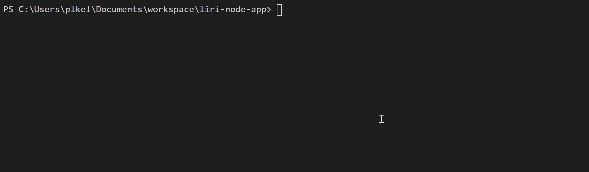
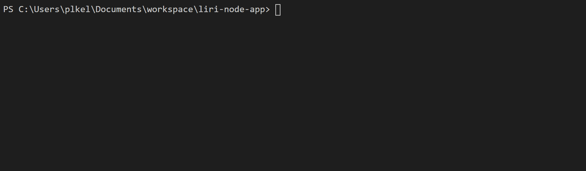
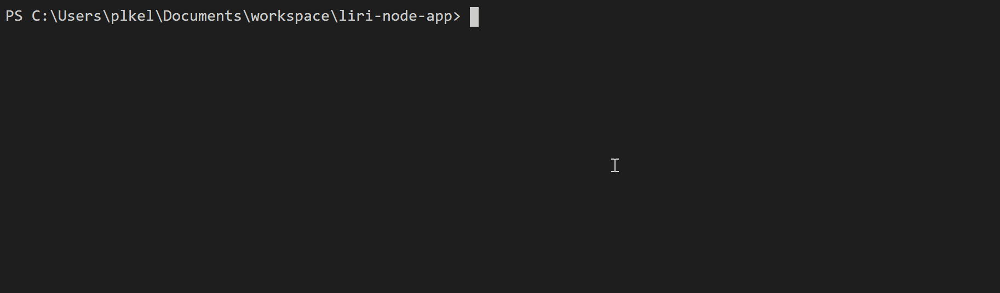
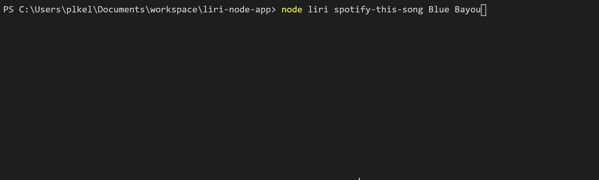
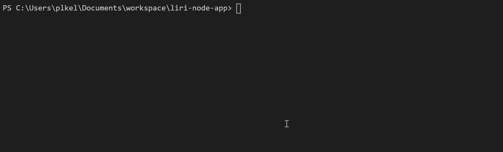
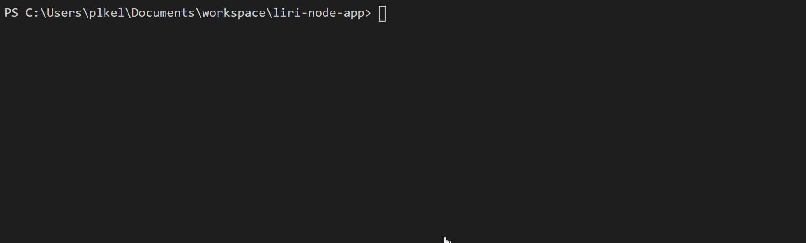
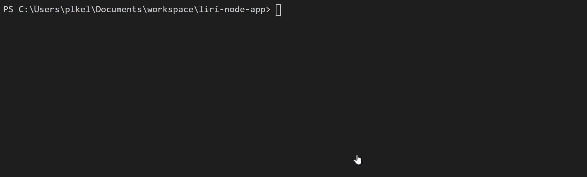

# Liri Bot

## Overview
Language Interpretation and Recognition Interface (LIRI) is a command line node application that accepts parameters and returns matching data via application programming interfaces (APIs).  The resulting data is returned to the user via console.log and appended to a log file.

### Features
LIRI includes four (4) features:

   1. `concert-this` - accepts the name of a singing artist or band and returns the following concert information using the "Bands In Town" API.
      * Venue name
      * Venue location
      * Concert date, formatted as "MM/DD/YYYY"
   2. `spotify-this-song` - accepts a song/track name and returns the following information using the "Spotify" API.
      * Artist(s)
      * Song name
      * Song preview link on Spotify
      * Album name
   3. `movie-this` - accepts a movie name and returns the following movie information using the "OMDB" API.
      * Title
      * Year
      * IMDB Rating
      * Rotten Tomatoes Rating
      * Country where produced
      * Language
      * Plot
      * Actors in the movie
   4. `do-what-it-says` reads the contents of random.txt, which contains the name of a LIRI feature and an input parameter, and then calls the feature using the supplied input parameter.

### Using LIRI

LIRI is launched by running one of the following commands on the command line:

1. **node liri concert-this _artist/band name_**
  * Calls the **concertThis()** function
  * Checks for missing artist name
  * Checks for missing user input
  * Console logs an error message to the screen if no artist/band name was provided
  * Formats the user's input, replacing spaces with "+"
  * Builds a query URL with the user's input and required API key
  * Makes an async call with the Axios NPM to the Bands In Town API
  * Console logs an error message if the response fails to return any concert dates
  * Console logs the response to the screen
  * Appends the response to the log.txt file 
2. **node liri spotify-this-song _song name_**
  * Calls the **spotifyThis()** function
  * Checks for missing song name
  * Checks for missing user input and defaults to "The Sign" if no song name was provided
  * Formats the user's input, checking for multi-word titles
  * Makes an async call with Spotify NPM to the Spotify API
  * Console logs an error message if the response fails to return any tracks
  * Console logs the response to the screen
  * Appends the response to the log.txt file
3. **node liri movie-this _movie name_**
  * Calls the **movieThis()** function
  * Checks for missing movie name
  * Checks for missing user input
  * Checks for missing user input and defaults to "Mr. Nobody" if no movie name was provided
  * Formats the user's input, replacing spaces with "+"
  * Builds a query URL with the user's input and required API key
  * Makes an async call with the Axios NPM to the OMDB API
  * Console logs an error message if the response fails to return any movies
  * Console logs the response to the screen
  * Appends the response to the log.txt file 
4. **node liri do-what-it-says**
  * Calls **justDoIt()** function
  * Reads contents of /files/random.txt
  * Calls the liri feature (value 1) using the provided input (value 2) in the file (e.g. spotify-this-song,I Want It That Way)

### Technology

1. LIRI Bot
  * Node JS v12.13.0, including the File System module
  * Axios Node Package Manager (NPM) v0.19.2 - https://www.npmjs.com/package/axios
  * Dotenv NPM v8.2 - https://www.npmjs.com/package/dotenv
  * Moment NPM v2.24 - https://www.npmjs.com/package/moment
  * Node Spotify API NPM v1.1.1 - https://www.npmjs.com/package/node-spotify-api
  * Bands In Town API - https://www.artists.bandsintown.com
  * OMDB API - https://www.omdbapi.com
  * Spotify API - https://www.npmjs.com/package/node-spotify-api

2. Display Results Page
  * HTML5
  * CSS3
  * JavaScript
  * jQuery
  * Google Fonts
  * Google Icons
  * Materialize CSS/JS

### LIRI Results

LIRI Bot is a command line application; accordingly, its commands cannot be run in a web browser.  Therefore, I have created a website at https://plkgit.github.io/liri-node-app/ that contains screenshots of the results of each command as well as a PDF copy of the log.txt file.  

Alternatively, see below for results screenshots and a PDF copy of the log.txt file after running each command.

1. **node liri**

Video: 

2. **node liri concert-this**

Video: 

3. **node liri concert-this U2**

Video: 

4. **node liri concert-this Billy Joel**

Video: 

5. **log.txt contents after concert-this**

6. **node liri spotify-this-song**

Video: 

7. **node liri spotify-this-song Blue Bayou**

Video: 

8. **node liri spotify-this-song 1zz6**

Video: 

9. **log.txt contents after spotify-this-song**

10. **node liri movie-this**

Video: 

11. **node liri movie-this WooFoo**

Video: 

12. **node liri movie-this Tootsie**

Video: 

13. **log.txt contents after movie-this**

14. **node liri do-what-it-says (spotify-this-song,I Want it That Way)**

Video: 

15. **node liri do-what-it-says (movie-this,Dave)**

Video: 

16. **node liri do-what-it-says (concert-this,Maroon 5)**

Video: 

17. **node liri do-what-it-says** (empty file)

Video: 

18. **log.txt contents after do-what-it-says**

**PDF of final log.txt**

[Download PDF](https://github.com/PLKGIT/liri-node-app/blob/master/images/log_02092020.zip)

## Development Details

### Developer
Pam Kelly at [esq.kelly@gmail.com](mailto:esq.kelly@gmail.com)

### GitHub Repository
[GitHub](https://github.com/PLKGIT/liri-node-app/) at https://github.com/PLKGIT/liri-node-app.

### Display Results website
[LIRIBOT Results](https://plkgit.github.io/liri-node-app/) at https://plkgit.github.io/liri-node-app/

### Porfolio
[Professional Porfolio](https://www.pamkelly.com/portdev.html) at https://www.pamkelly.com/portdev.html

Copyright &copy; 2020 Pamela L. Kelly